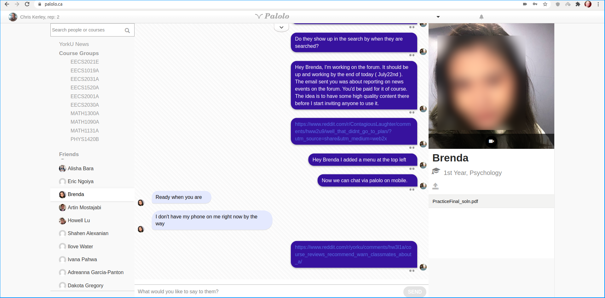
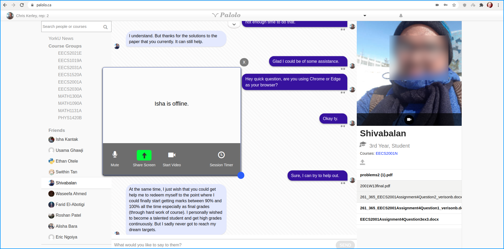

### Palolo Education Frontend

## Tools Used
1. Javascript ES5/ES6
2. KnockoutJS 3.4
3. RequireJS
4. Jasmine Unit Testing Framework

All features custom built by yours truly.
About *16 months* of work.

## Class Forum - Websockets

## Real Time Two-Way Blackboard using Websockets.

## One-on-One Chat

## Note Sharing

## Real Time Two Way Video Chat

# Teacher Payment Plans

## Facebook 1.0 Style Notifications

