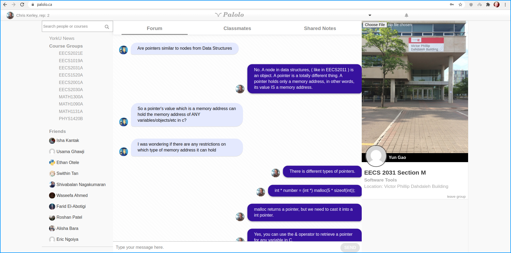
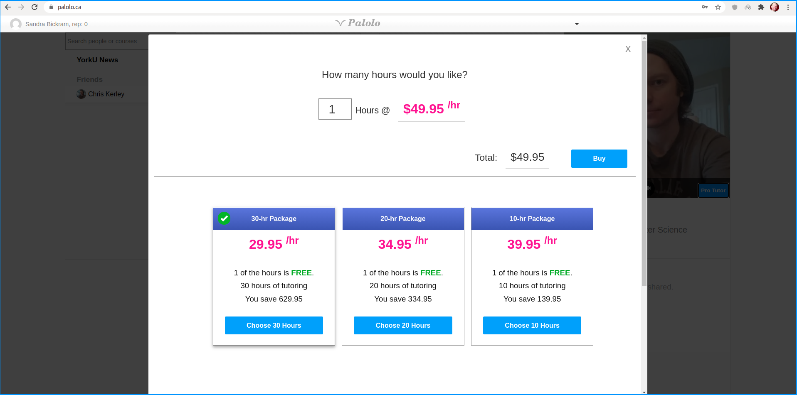

### Palolo Education Frontend

## Tools Used
1. Javascript ES5/ES6
2. KnockoutJS 3.4
3. RequireJS
4. Jasmine Unit Testing Framework
5. Websockets (socket.io client)
6. Lots of elbow grease.

About *16 months* of work to build this and all the micro-services for it.

## Setup:
Serve the front-end using PHP. i.e. Expose to content of the
public folder in the top directory. Note that the front-end
relies on several micro-services that must be running.

## Custom OAuth Implenmentation
- Token based authentication.
<space>

## Class Forum
- Uses Websockets
- Supports hundreds of simultaneous users.
<space>

## Real Time Two-Way Blackboard using Websockets.
- Saves blackboards between sessions.
- Offers multiple boards that can be flipped through.
- Offers the ability to email boards to other students or teachers.
- Full-screen capability.
- Simple clean design.
<space>

## One-on-One Chat
- Real time chat using Websockets
- File sharing / file uploading to during one-on-one chat.
- Friending of chat mates.
<space>

## Note Sharing
<space>

## Real Time Two Way Video Chat
- Video chat implemented using WebRTC.
- Can be used with Twilio or my custom built signalling server.
- P2P data reduces network traffic on the server, saving costs.
<space>

# Teacher Payment Plans
- Payments implmented using Stripe.
<space>

## Facebook 1.0 Style Notifications
- Reddit style board for York University featuring post voting capability.
- Facebook style drop-down notifications.
<space>

## Class List
- See everyone in your class list.
- Adds friends from your class.
<space>

## Responsive Mobile Design

